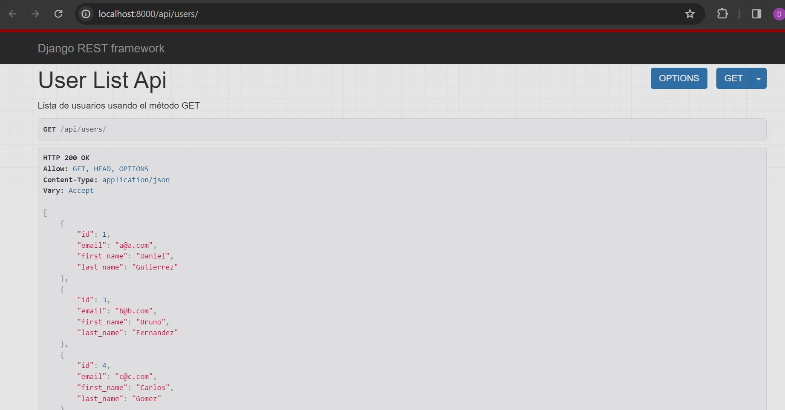

# PruebaSoftware_01-2024 (SunnyApp Robotics)


__Autor__: Daniel Alexander Gutierrez Orozco

Este proyecto esta dividido en backend y frontend, fue realizado con Django Rest Framework y React JS. Base de datos PostgreSQL.

- La sección de frontend fue desplegada en AWS Amplify:

https://production.dzl7l65fl1h4v.amplifyapp.com/home


- Backend fue desplegado en Heroku:

https://sunnyapp-backend-d3992be5f943.herokuapp.com/api/graphs/


- Base de datos PostgreSQL desplegada en Render.

---
<br>

__Versiones usadas en desarrollo__

- Sistema operativo local: Windows 10
- Entorno de desarrollo: Visual Studio Code
- Versión de Git: 2.39.1.windows.1
- Versión de Python: 3.11.1
- Versión de djangorestframework: 3.14.0
- Versión de Node: 18.13.0
- Versión react: 18.2.0
- Versión vite: 5.0.8
- Versión base de datos PostgreSQL: 14


---
<br>

Estos son los pasos para descargar y ejecutar el proyecto en local:


## Backend

### Guía de descarga a local:


__1.__ Abre la terminal o línea de comandos en el computador donde deseas descargar el proyecto.

__2.__ Navega al directorio donde deseas almacenar el repositorio.

__3.__ Ejecuta el siguiente comando de Git para clonar el repositorio a la carpeta actual:

```sh
git clone https://github.com/dago-tech/PruebaSoftware_01-2024.git
```

__4.__ Muévete a la rama daniel_alexander_gutierrez_orozco:
```sh
git checkout daniel_alexander_gutierrez_orozco
```

__5.__ Navega en la consola hasta la carpeta Codigo/Backend/ y crea y activa un entorno virtual en la carpeta del proyecto:
```sh
py -m venv venv
```

En powershell:
```sh
venv\Scripts\activate
```
En bash:
```sh
source venv/Scripts/activate
```

__6.__ Instala todas las dependencias:
```sh
pip install -r requirements.txt
```

__7.__ Debes tener PostgreSQL instalado y crear la base de datos con usuario y contraseña. Se deben ajustar los parámetros de la base de datos en el archivo settings.py


- Luego se deben hacer las migraciones a la base de datos, aquí se crean las tablas en ella:

```sh
py manage.py makemigrations
py manage.py migrate
```

__8.__ Correr el servidor de desarrollo:
```sh
py manage.py runserver
```

__9.__ Ya se pueden hacer solicitudes HTTP a este servidor, por ejemplo, usando:

Método GET -->
http://localhost:8000/api/users/



---


## Frontend

### Guía de descarga a local


... Después de haber realizado los pasos anteriores


__1.__ Navega en la consola hasta la carpeta Codigo/Frontend/

__2.__ Instala las dependencias del package.json
```sh
npm i
```
__3.__ Correr el servidor de desarrollo:
```sh
npm run dev
```

__4.__ Ya se puede visitar la aplicación haciendo uso de http://localhost:5173/home. 


---

## Consideraciones

__Endpoints:__
El backend genera una API tipo REST:

- Consola de admin de Django:
```
GET --> admin/
```

- Listado de usuarios:
```
GET --> api/users/
```

- Creación de usuario:
```
POST + body{}-->  api/users/create/
```

- Email asociado al usuario con el id enviado:
```
GET -->  api/users/get_user_email/<int:user_id>/
```

- Envío de refresh token para ser enviado a lista negra:
```
POST + body{} --> api/users/logout/blacklist/
```

- Listado de registros del dataset
```
GET --> api/graphs/
```

- Creación de registro del dataset:
```
POST + body{} --> api/graphs/create/
```

- Eliminación de registro de dataset asociado su id:
```
DELETE --> api/graphs/delete/<int:pk>/
```

- Solicitud de access y refresh tokens:
```
POST + body{} --> api/token/
```

- Solicitud de access y refresh tokens cuando se vence access token:
```
POST + body{} --> api/token/refresh/
```


- Se usa la librería simpleJWT para el manejo de la autenticación de usuarios por parte del backend

- Se utilizan estilos CSS para algunos elementos y para otros se usan elementos predefinidos de la librería Material UI

- Todos los datos de usuarios y dataset de la tabla y gráfica se guardan en la base de datos de PostgreSQL.